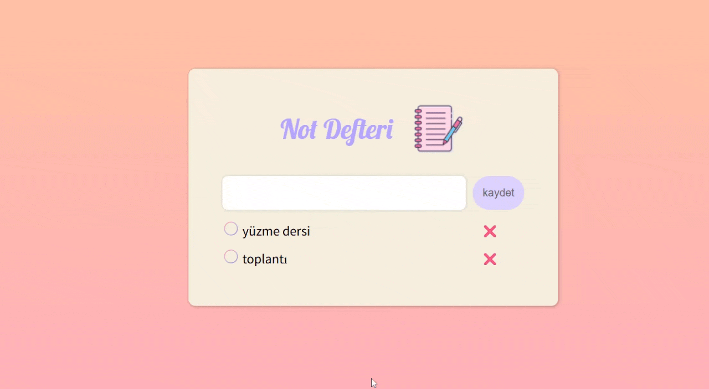

# To Do List 

 Bu proje, basit ama kullanışlı bir **Not Defteri / To-Do List** uygulamasıdır.  
Kullanıcılar not ekleyebilir, tamamlandı olarak işaretleyebilir, silebilir ve ekledikleri notları **LocalStorage** sayesinde tarayıcı kapansa bile saklayabilir.

## 🎯 Projenin Amacı
Bu proje, **HTML**, **CSS** ve **JavaScript** kullanarak **dinamik, etkileşimli ve kullanıcı dostu** bir uygulama geliştirme pratiği yapmak için hazırlanmıştır.  
Ayrıca **SweetAlert2** kütüphanesi ile daha estetik uyarı ve bildirim pencereleri eklenmiştir.

## 🚀 Özellikler
- 🖊️ **Not ekleme**  
  - Boş not eklenmek istenirse uyarı verir.
  - Enter tuşu veya buton ile ekleme yapılabilir.
- ✅ **Tamamlandı olarak işaretleme**  
  - Not üzerine tıklandığında üstü çizilir ve rengi değişir.
- ❌ **Not silme**  
  - X butonuna tıklanarak not silinir.
- 💾 **Verilerin saklanması**  
  - Tarayıcı LocalStorage kullanılır, sayfa yenilense bile veriler korunur.
- 🎨 **Modern, pastel tonlarda arayüz**
- ⚠️ **SweetAlert2 ile estetik uyarılar**

  
## 🖼️ Ekran Görüntüsü
> Örnek arayüz görseli:

## 📌 Kullanım

* Metin kutusuna notunuzu yazın.

* Kaydet butonuna tıklayın veya Enter tuşuna basın.

* Notun üstüne tıklayarak tamamlandı olarak işaretleyin.

* X butonuna tıklayarak notu silin.

* Notlarınız otomatik olarak tarayıcınızda saklanır.

## Canlı Demo 

[projeyi Tarayıcıda Görüntüle](https://rahile0120.github.io/To-Do-List/)
